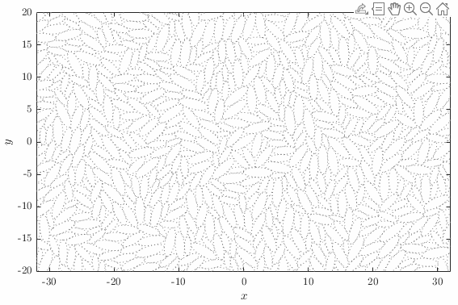

# xDEM

A 2D Discrete Element Method, acceletated by OpenMP library.

For non-commercial use.

Author E-mail: xiaoxiao0129jp@gmail.com


## Particle type
All particle types are derived from ```BaseParticle``` class.\
You can define your own particle type easily, by mainly providing the virtual function 
```
bool calculateContactGeometry(
    const BaseParticle* otherParticle, 
    ContactGeometry& contactGeometry, 
    const vector2d& offset, 
    const vector2d& offsetVel
    )
```
which tells the contact information such as contact point, contact normal and so on.
1. Circular particle ```CircularParticle```.
2. Elliptical particle ```EllipticParticle```.
Two different contact detection algorithms are provided (!!!ALL contact detections of ellipses would eventually reduce to the problem of solving a quartic equation).
    1. A traditional and direct approach, which finds the two intersection points of two interacting ellipses. Quartic euqation is solved using the approach proposed by Strobach, P. (2010). The fast quartic solver. Journal of computational and applied mathematics, 234(10), 3007-3024. The initial guesses are determined by https://en.wikipedia.org/wiki/Quartic_function.
    2. A closest distance based approach (see Zheng, X., & Palffy-Muhoray, P. (2007). Distance of closest approach of two arbitrary hard ellipses in two dimensions. Physical Review E, 75(6), 061709.). The advantage of this approach is that only one positive real root of the quartic is required, so that this can be found using Newton-Raphson Method (https://en.wikipedia.org/wiki/Newton%27s_method), thus issues about complex numbers are avoided.
4. Clump particle, ```GluedParticle``` as up level particle, with others as lower level to represent the geometory.

## Boundary condition
All boundary conditions are derived from ```BaseWorld``` class.
1. Periodic boundary condition ```PeriodicBoundaryWorld```, with fixed-size double-periodic boundary condition.
2. Stress or strain controlled periodic boundary condition ```PeriodicControlWorld```.
3. Lees-Edwards boundary condition ```LeesEdwardsBoundaryWorld```, for shear test.

## Contact model
All contact models are derived from ```BaseContactModel``` class.\
Define the name of your contact model as ```ContactModel``` in header ```ContactModelList.h```, for example,
```
typedef ContactModel_LinearDissipativeFrictioanl ContactModel;
```
1. Linear spring-dashpot contact model with Coulomb friction ```ContactModel_LinearDissipativeFrictioanl```.

## Statistics
All statistics can be directly done by passing ```vector<BaseParticle*>&``` (contact information are automatically included), or from the output files.
- Quadron and Cell analysis ```QuadronAnalysis```.\
Find rattlers, compute rattler-free coordination number and solid fraction, construct cells and quadrons, compute their geometrical and mechanical properties, detect cell break and merge, and so on.\
    [1] Ball, Robin C., and Raphael Blumenfeld. 2002. “Stress Field in Granular Systems: Loop Forces and Potential Formulation.” Physical Review Letters 88 (11): 115505.\
    [2] Matsushima, Takashi, and Raphael Blumenfeld. 2014. “Universal Structural Characteristics of Planar Granular Packs.” Physical Review Letters 112 (9): 098003.\
    [3] Matsushima, Takashi, and Raphael Blumenfeld. 2017. “Fundamental Structural Characteristics of Planar Granular Assemblies: Self-Organization and Scaling Away Friction and Initial State.” Physical Review. E 95 (3-1): 032905.\
    [4] Wanjura, C. C., Gago, P., Matsushima, T., & Blumenfeld, R. (2020). Structural evolution of granular systems: theory. Granular Matter, 22(4), 1-9.

- Cluster labelling algorithm ```ClusterLabelling```, used for elliptical particles.\
    [1] Jiang, Xiaoyu, Takashi Matsushima, and Raphael Blumenfeld. 2021. “Structural Characteristics of Ordered Clusters in Packs of Ellipses.” EPJ Web of Conferences 249: 06004.




## ToDo
- [ ] Add binary file output
